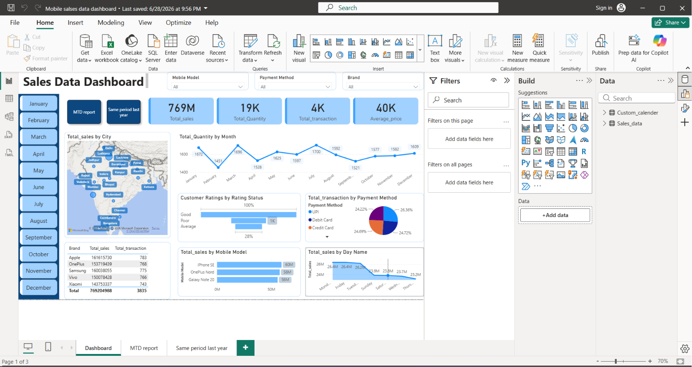

# Mobile-sales-analysis-Power-BI
# Mobile Sales Analysis Dashboard

## Project Overview

This project analyzes mobile phone sales data using Microsoft Power BI
to understand sales performance, customer purchasing behavior, product
performance, and sales trends.

The data was cleaned and transformed using Power Query and analyzed
through interactive Power BI visualizations and DAX measures.

## Tools & Technologies

- Microsoft Power BI
- Power Query
- DAX
- Data Cleaning
- Data Visualization

## Key KPIs

- Total Sales
- Total Quantity Sold
- Total Transactions
- Average Selling Price

## Dashboard Features

- Sales analysis by mobile brand
- Sales analysis by mobile model
- Sales by city
- Sales by payment method
- Sales by customer ratings
- Monthly sales trends
- Quantity sold analysis
- Transaction analysis
- Interactive slicers and filters

## Key Insights

- Identified top-performing mobile brands and models.
- Analyzed sales trends over time.
- Compared sales performance across different cities.
- Analyzed customer ratings and purchasing behavior.
- Compared different payment methods.
- Identified products contributing the most to overall sales.

## Dashboard Preview

## Project File

The Power BI `.pbix` file is included in this repository.
